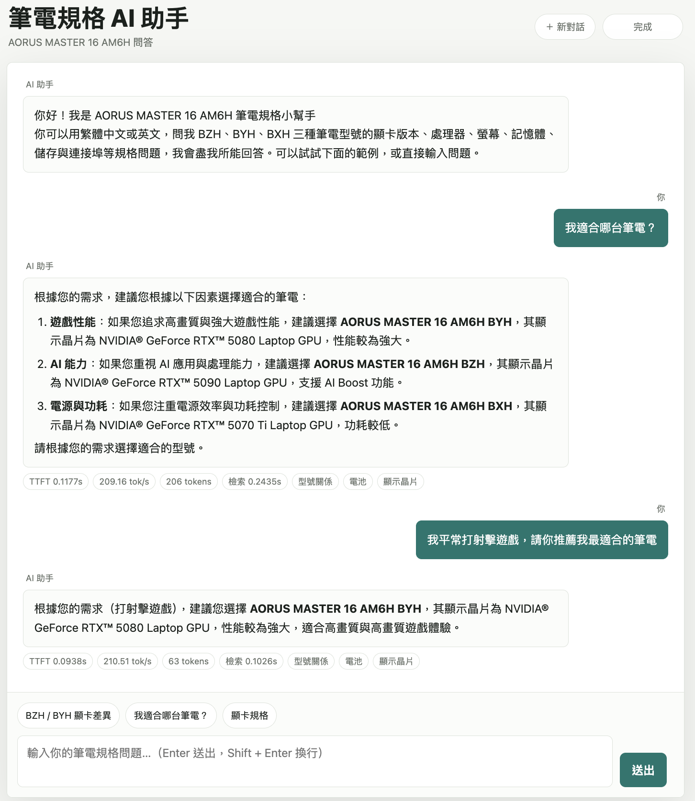
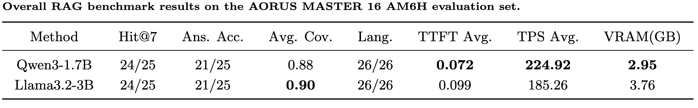

# AORUS MASTER 16 AM6H — 規格問答 RAG



## 1. 簡介

這是一個RAG問答系統，回答 **GIGABYTE AORUS MASTER 16 AM6H** 系列筆電的產品規格。支援**繁中／英文**混合提問、**串流輸出**、**多輪對話記憶**，並附一個單頁聊天網頁。設計目標是在 **≤4GB VRAM** 的環境穩定運作。

- **無框架**:不依賴 LangChain／LlamaIndex，chunking／retrieval／generation 全部手寫(`src/rag/`)。
- **推論引擎**:`llama.cpp`(`llama-cpp-python`)，SLM 全層 GPU offload、Embedding Model跑 CPU，把VRAM全留給 SLM。
- **雙模型 A/B**:`MODEL=qwen|llama` 一鍵切換，比較生成能力。
  - `qwen`(預設):`MaziyarPanahi/Qwen3-1.7B-GGUF`(Q4_K_M)，關閉 thinking。
  - `llama`:`bartowski/Llama-3.2-3B-Instruct-GGUF`(Q4_K_M)。
- **共用嵌入**:`Qwen/Qwen3-Embedding-0.6B-GGUF`，兩個模型共用同一個Model → 同一份索引，A/B 只比較「生成」一個變因。
- **環境/部署**:`uv` 管理套件;Docker(GPU)一鍵啟動。

| 硬性限制 | 做法 |
|---|---|
| ≤4GB VRAM | SLM放GPU執行且n_ctx=8192下，兩模型分別消耗Vram:Qwen 2.95GB／Llama 3.76GB |
| 無框架 | `chunk.py` / `retrieve.py`(BM25+RRF) / `index.py`(NumPy cosine) / `prompt.py` / `llm.py`  |
| uv 管理 | `pyproject.toml` + `uv sync` |
| 串流輸出 | `llm.stream()` 逐 token yield |

---

## 2. 程式啟動步驟

> 需求:Linux + NVIDIA GPU + NVIDIA Container Toolkit。容器啟動時自動 ① 下載 GGUF 模型 ② 解析 HTML 建索引 ③ 啟動服務，`models/`、`data/` 以 volume 掛載。

### Docker

```bash
# 啟動 Qwen3-1.7B，然後開瀏覽器 http://localhost:8000 使用聊天網頁
docker compose up -d --build rag

# 切換到 Llama-3.2-3B
docker compose up -d --build rag-llama
```

聊天網頁(`http://localhost:8000`)支援串流逐字輸出、markdown 排版、範例提問、多輪記憶與新對話功能。

API(SSE 串流):

```bash
curl -N "http://localhost:8000/chat?question=螢幕的更新率是多少？"
curl -N "http://localhost:8000/chat?question=Which GPU does it use?"
```

評測、VRAM 使用量量測（目前Repo已經執行完了）:

以Qwen3-1.7B為例
```bash
docker compose exec rag uv run --no-sync python eval/run_eval.py           # 輸出→ eval/results/<model>/benchmark.md
docker compose exec rag uv run --no-sync python scripts/vram_report.py     # 輸出→ eval/results/used_vram.json
```


> **設定**:如果要跑 Llama 請在`.env`上填入 HF_Token，需要先取得Llama授權。  
常用變數:`MODEL`、`N_CTX`(預設 8192)、`MAX_TOKENS`(1024)、`TOP_K`(7)、`N_GPU_LAYERS`(-1)。完整見 `src/rag/config.py`，都有預設值可以不用更動。


### 本機 uv(無 Docker 時使用，不是很建議，因為我沒有測試過這方法能不能成功)

```bash
uv sync
uv run python scripts/download_model.py   # 下載 GGUF → models/
uv run python scripts/scrape.py           # 解析 HTML → data/processed/spec.jsonl
uv run python scripts/build_index.py      # 切塊 + 嵌入 → data/index/
uv run uvicorn app.server:app --host 0.0.0.0 --port 8000   # 啟動服務，開 http://localhost:8000
```

---

## 3. 專案架構與資料流

```
■ 離線階段：建立索引（只做一次）

  產品規格 HTML + variants.json
      │  scrape — 解析 spec-item-list 成結構化 Key-Value
      ▼
  spec.jsonl（17 筆 Key-Value）
      │  chunk + variants — 多粒度切塊，併入 BZH / BYH / BXH 三種 GPU 版本
      ▼
  62 個文字塊
      │  embed — Qwen3-Embedding（CPU）
      ▼
  NumPy 向量索引（embeddings.npy + chunks.jsonl）


■ 線上階段：每次提問（檢索 → 生成）

  使用者問題
      │  對「向量索引」同時做兩路檢索：
      │    • dense   — 向量 cosine 相似度
      │    • sparse  — BM25 關鍵字
      ▼
  RRF 融合排名 → 取 top-7 規格塊
      │
      ▼
  組裝 prompt（系統提示 ＋ top-7 規格 ＋ 對話記憶）
      │
      ▼
  llama.cpp 逐 token 串流生成
      │
      ▼
  串流答案
```

```
gigabyte-rag/
├── data/raw/am6h_spec.html      # 規格頁原始 HTML（唯一資料來源）+ variants.json（BZH/BYH/BXH）
├── data/processed/spec.jsonl    # 解析後的 K-V（產生物）
├── data/index/                  # embeddings.npy + chunks.jsonl（共用索引，產生物）
├── models/{qwen,llama,embedding}/*.gguf   # 權重       （gitignore，啟動時自動下載）
├── src/rag/
│   ├── config.py     # 所有設定，環境變數可覆寫
│   ├── scrape.py     # 解析 spec-item-list → 結構化 K-V
│   ├── variants.py   # 併入 BZH/BYH/BXH 三個 GPU 版本的規格塊
│   ├── chunk.py      # 多粒度切塊（row / line）
│   ├── embed.py      # llama.cpp 嵌入封裝（Qwen3-Embedding GGUF， CPU）
│   ├── index.py      # NumPy 向量索引（cosine）
│   ├── retrieve.py   # 手寫 BM25 + dense + RRF 混合檢索
│   ├── prompt.py     # ChatML / llama3 模板 + 語言注入 + 對話記憶
│   ├── llm.py        # llama.cpp 串流 + TTFT/TPS 計時
│   └── pipeline.py   # 串起 retrieve → prompt → generate（含記憶裁切）
├── app/
│   ├── server.py     # FastAPI SSE 服務 + 對話記憶（Docker 入口）
│   └── frontend.html # 單頁聊天網頁（串流、markdown、記憶、新對話）
├── scripts/          # download_model / scrape / build_index / vram_report / entrypoint
├── eval/             # questions.jsonl + run_eval.py + results/<model>/benchmark.md
└── Dockerfile + docker-compose.yml
```

---

## 4. 研究方法(RAG 具體技術)

1. **解析(scrape.py)**:規格頁的每一項規格都是一個 `<ul class="spec-item-list">` 區塊,其中 `spec-title` 是欄位名稱、`spec-desc` 是對應的值。程式將它們逐一解析成乾淨的「欄位 → 值」對應。另外再將BZH／BYH／BXH 三種 GPU 版本的差異再由 `variants.py` 補上並併入索引。

2. **多粒度切塊(chunk.py)**:結構化規格**不能用固定字數亂切**(會把「2560×1600」跟「顯示器」拆開)。因此:
   - **row 粒度**:一個分類一塊(適合「BZH的螢幕規格?」這種綜合題)。
   - **line 粒度**:連接埠/顯示器這種多行值，逐行各成一塊(適合「BZH的連接埠有沒有 Thunderbolt 5?」這種精確題)。
   - 每塊都寫進英文別名，讓英文問題也能命中繁中欄位。

3. **向量索引(index.py)**:資料量小只有62塊，不用特別加速技術。向量單位正規化後存成 NumPy 矩陣，查詢時一次**矩陣相乘**即得對所有塊的 cosine 相似度，取 top-k。

4. **混合檢索(retrieve.py)**:規格題充滿須精確命中的字串(型號、240Hz、Thunderbolt 5)，純語意向量易漏，故再加**BM25**，兩條排名用 **RRF(Reciprocal Rank Fusion)** 融合，免去分數尺度問題。設定`top_k=7` 讓高 IDF 的機型碼不會把真正分類擠出。

5. **Prompt(prompt.py)**:Qwen **關閉 thinking**(在 assistant 開頭預塞空 `<think></think>`，當作Instruct Model使用)。System Prompt要求只依規格作答、找不到就明說「官方規格表未提供」。**語言控制採動態注入**:偵測問題語言後，把「請用繁體中文/Please answer in English」加在 **user prompt 最後一行**——小模型對此處指示的遵循度遠高於埋在 system prompt。

6. **生成 + 串流(llm.py)**:llama.cpp 載入 GGUF，逐 token 串流，同時記錄 **TTFT**(首 token 延遲)與 **TPS**(每秒 token 數)。

7. **多輪記憶(server.py + pipeline.py)**:伺服器端依 `session_id` 保存對話歷史(滾動視窗，最近 16 則)。每次回答前用模型自己的 tokenizer 量測，把 `n_ctx − max_tokens − 規格上下文 − 安全餘量` 的剩餘額度，**從最新往舊**塞入放得下的歷史(放不下就丟)，保證不超出 context;追問時並把上一句問題併入檢索 query，讓追問也能檢索到正確塊。不做摘要，省一次 LLM 呼叫。

---

## 5. 實驗結果

Evaluation set: 我在`eval/questions.jsonl` 共設計 **26 題**(25 題可答的規格題 + 1 題刻意問規格外的問題，測拒答能力)，涵蓋繁中/英文、單一規格、跨型號比較與拒答。指標分量化(TTFT/TPS)與定性(檢索命中、答案正確、拒答、語言一致)。



**評測結果分析**:在檢索Hit@7方面，兩個Model命中都只漏掉一題。在答案品質方面，也是打平(各21/25);逐題檢視顯示兩者各有一處硬傷(Qwen 否認 q18 BZH 的 HDR 支援;Llama 在 q09 幻覺出「128GB」記憶體)。最重要的一點是，在效能與資源方面，**Qwen 明顯較優**:TTFT 快約 28%、TPS 高約 21%、VRAM 少 0.8GB，因此通過評測後我最終選擇使用參數量較小的Qwen，因為能力上跟Llama-3.2-3B相近，但在速度方面，能夠有20~30%的效能提升，以及節省0.8GB的Vram，因此預設Model設定為Qwen。


## 6. 結論與模型選擇理由

首先這個專案在 ≤4GB VRAM 的限制下，並且要同時支援中文與英文，我第一時間就想到qwen的小模型，因為Qwen中文語料可能訓練較多，第二個順位就是Llama，因為Llama在對話方面能力有不錯的成績，因此此專案採用兩者的SLM來互相對比，並採用性能較好的那顆模型作為預設模型。  
再來，考量規格屬於結構化資料，因此採用「整類＋逐行」多粒度切塊搭配 dense＋BM25＋RRF 混合檢索，讓型號、240Hz、Thunderbolt 5 這類必須精確命中的內容也能可靠撈回命中；再透過 llama.cpp 把 LLM 放 GPU、嵌入模型跑 CPU，配合嚴格的系統提示與關閉 thinking，在低資源下同時兼顧速度與正確性，規格外的問題也會誠實拒答。  
最後我在同一套檢索下，分別比較 A/B 兩個模型，答題品質打平（各 21/25），但 Qwen3-1.7B 比 Llama-3.2-3B-Instruct 更快、更省 VRAM，因此設為預設，Llama 則保留作備援、語料變大時可一鍵換上。
